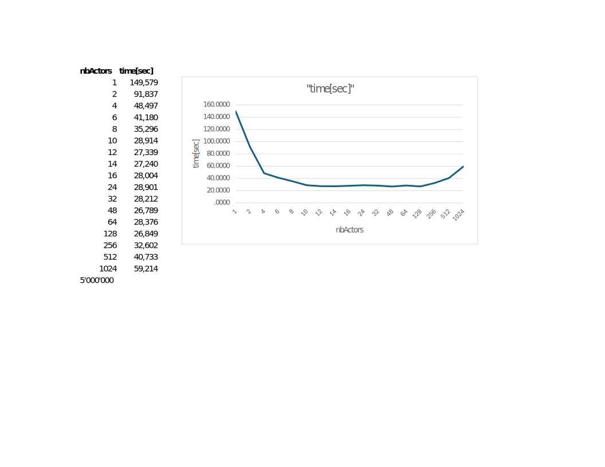
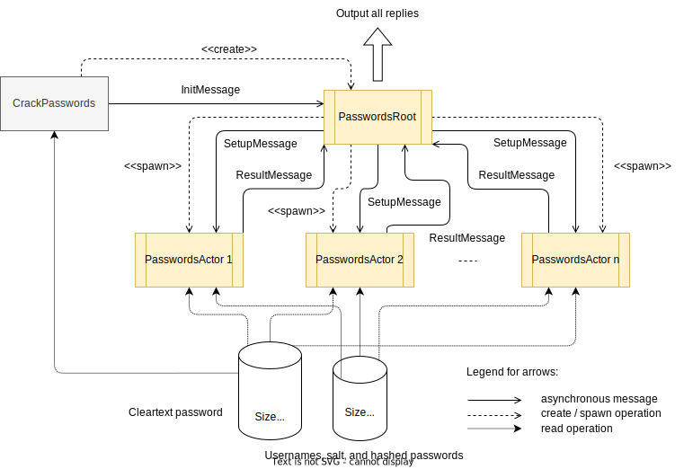

# Concurrent Password Cracking

This exercise focuses on a concurrent implementation to crack passwords.

For security reasons passwords are never stored in cleartext in databases, but as hash values. Suppose an attacker obtained a list of passwords of users that are hashed. The file `hashed-passwords.txt` contains a list of e-mail addresses together with the hashed passwords and the salt information, for example:

```code
bie0@bfh.ch 123 +lQcRMi401df27pbsl4HO75AjfQtshDhiftxnqmMvzjj8gwzxxDgGRH9UaRjORAA1lNtnXGj8S98yEYOO29giw==
```

In the example above, `bie0@bfh.ch` is the username (an e-mail address) and `123` the salt. The third component of the line `+lQcRMi40...==` is the hashed password.

A hashed password `h` is obtained by hashing (SHA-512) the password of the user concatenated with a salt:

```code
h=SHA512(password+salt);
```


## Goal of the exercise

The goal of this exercise is to crack the hashes of passwords contained in file `hashed-passwords.txt`. There is a list of 5 millions passwords in a file called `5-million-passwords.txt`. The task is to test for each user in file `hashed-passwords.txt` if there is a correspondence to one password available in cleartext. A pure, sequential solution is given as a separate class `ch.bfh.akka.crack.sequential.CrackPasswords`.

If compiled with Maven, start it by typing:

```console
mvn -q exec:exec -Pseq
```
Alternatively, run it via your IDE.

Unfortunately, cracking a huge list of passwords takes a lot of time. The task is to use the Akka framework and its concurrent actors to improve the sequential solution. The idea is to create several actors and assign a portion the hashed passwords to each actor that will perform the job concurrently on several cores of your system.

## Assignment

Implement an Akka actor system that performs the following:

- Create a root actor.
- The root actor starts `nbActors` password cracker actors.
- The root actor reads the list of known passwords in file `5-million-passwords.txt` and counts its length.
- The root actor calculates the `start` and `end` positions of the portions of this file and sends these values together with the file names to every password cracker actor.
- Each password cracker actor reads the files `5-million-passwords.txt` and `hashed-passwords.txt` and, for its portion only, tries to find a match of a cleartext password with a user of the hashed password file.
- Each time a password cracker actor discovers a match, it collects the found username and password.
- When finished its portion, a password cracker actor sends the collected results to the root actor and then terminates.
- The root agent prints the list of all found passwords, measures the total time spent, and then terminates.
- Upon termination, the actor system terminates after approximately one minute.

When done with your Akka implementation, run it with multiple values of `1`, `2` and multiples of `2` and measure the time used. Provide a graph having the following form and replace the given values it with your values:


- My timetable for of the execution is:


## Skeleton Classes

Three skeletons of classes are given in package `ch.bfh.akka.crack.parallel`. They form the basis of
system of actors:




## Import into your favorite IDE

This is a Maven project. Just import the project (use 'Open...' in IntelliJ,
use 'Import...' -> 'Existing Maven Project' in Eclipse).


## Compilation

Assuming you have the Maven command available in your terminal,
to compile the demo application, type:

```console
mvn clean compile
```

## Execution

To execute the programs in an IDE, select the corresponding
`Main` class and execute it.

To execute the pure sequential program from a command window with Maven, type:

```console
mvn -q exec:exec -Pseq
```
To execute the Akka version of the program from a command window with Maven, type:

```console
mvn -q exec:exec [-DnbActors=N]
```
where `N` is `1`, `2` or a multiple of `2`. Default is `4`.


## Javadoc

To generate the Javadoc API documentation for all
samples, type:

```console
mvn clean compile javadoc:javadoc
```

This generates the Javadoc documentation in directory `target/site/apidocs`.
